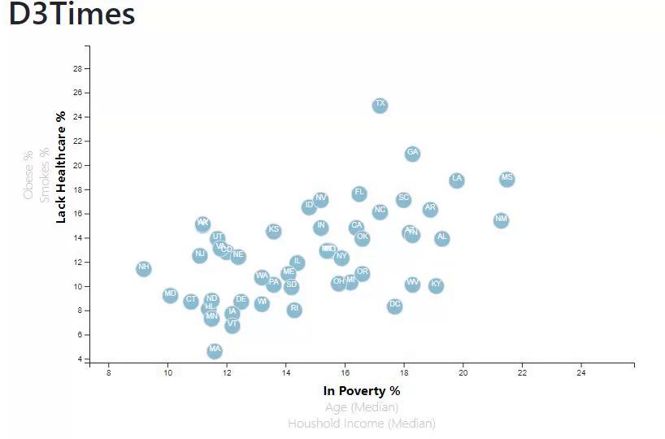

# D3 Scatter Chart

In this repo we used `d3 library` in JavaScript to create `new SVG` with spacific size for Axises, circles, texts and tooTip, that give you advantage to not loss quality of the picture once you zoom it in.

You can see folder name's `basic scatter chart` has scatter chart with one label for X and Y.

In the main page there is chart `More Dynamics` you can `change X labeles` and `Y labeles` so will appear new circles give you new information using toolTip for every State.

You'll need to use `python -m http.server` to run the visualization. This will host the page at `localhost:8000` in your web browser.

And here we go interact picture for the chart:

